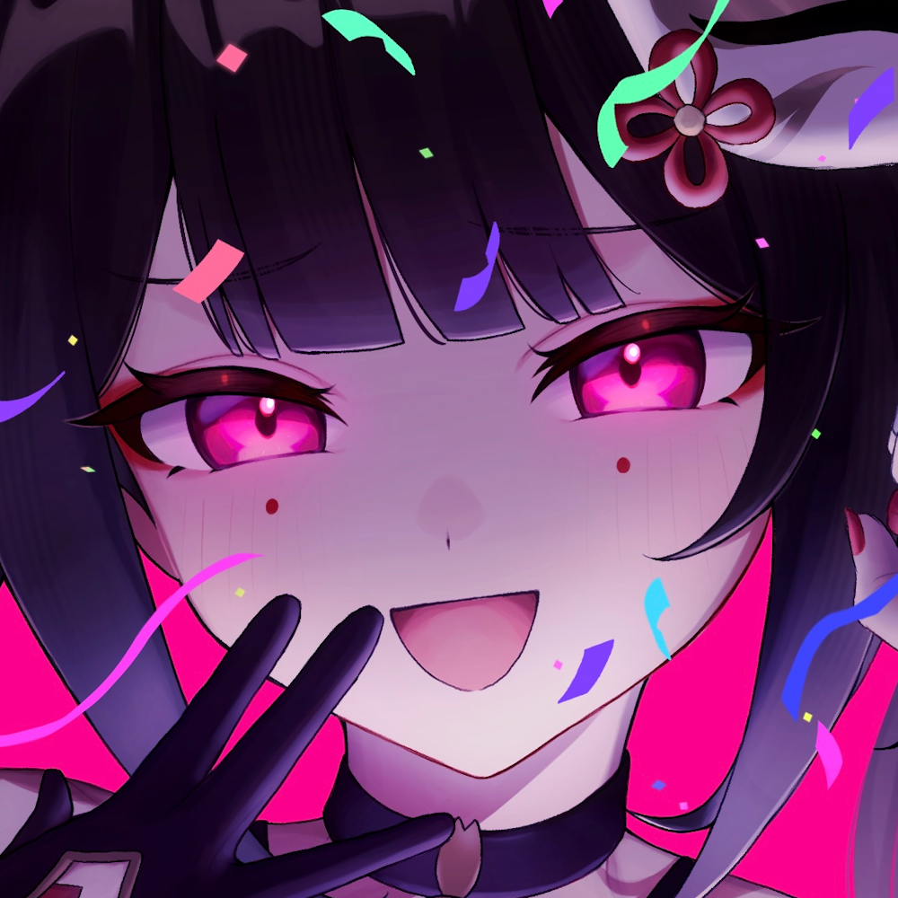
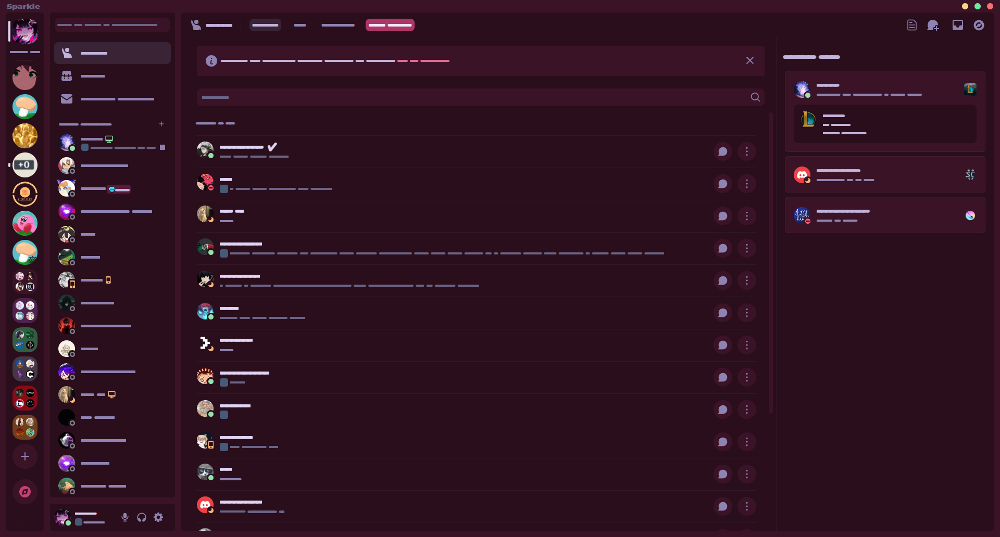
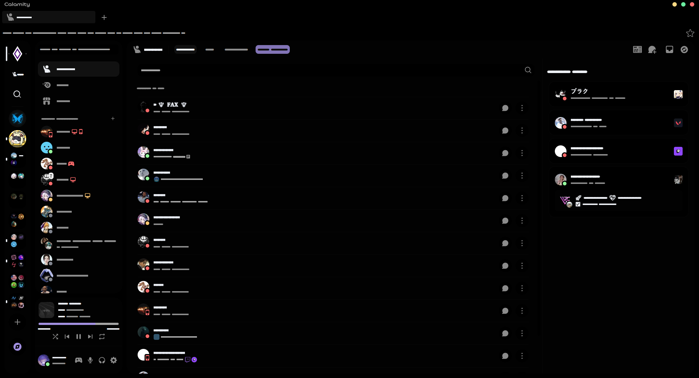

# Waifu-Cord Themes

A collection of Discord themes inspired by anime waifus and more! 😇

Feel free to open a pull request with your own variant (preferably including a preview placed inside the `/previews` folder).

---

## Themes

- [Cantarella](#cantarella)
  - [Dark](#cantarella)
  - [Catppuccin (Mocha Mauve)](#catppuccin-mocha-mauve)
- [Sparkle](#sparkle)
- [Calamity](#calamity)

---

## Cantarella 

> Credits: [refact0r](https://github.com/refact0r) for providing the [base theme](https://github.com/refact0r/midnight-discord).

A darkened Discord theme with rounded chat and sidebars.

### Variants

#### Catppuccin (Mocha Mauve)

---

## Sparkle 

> Credits: [refact0r](https://github.com/refact0r) for providing the [base theme](https://github.com/refact0r/midnight-discord).

---

## Calamity 

Old theme that was based on a project i used to work on, which i made using midnight.

