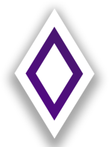

# Themes that are based on anime waifus and others 😇

# Cantarella 
> credits go to [refact0r](https://github.com/refact0r/midnight-discord) for providing the base theme.
>> please feel free to open a pull request with your own variant. (preferrably including a preview placed inside /previews folder)

### a darkened discord theme with rounded chat and sidebars.

## variants

### catppuccin (mocha mauve)

# Calamity 
> old theme that was based on a project i used to work on, which i made using midnight.

